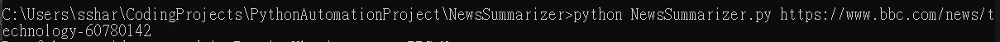
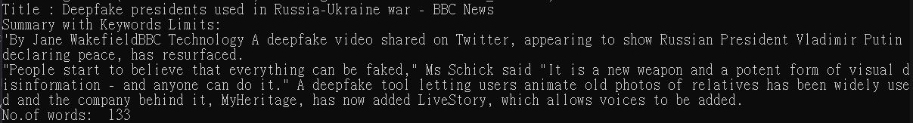
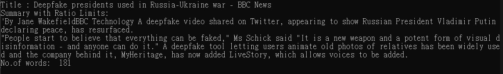
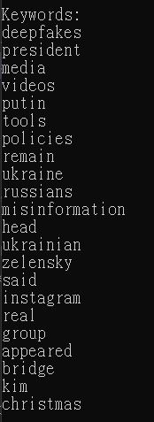

# PythonNewsSummarizer
A python script that summarizes news using NLP algorithms (Extraction Summarize)

# Project Overview
- Fetch News from URL and filter out news contenct (plain text) using beautifulSoup and regex matching
- Generate summary and keyword sets from plain text using NLP algorithms powered by Gensim

# Project Demo 
### [Example News Used](https://www.bbc.com/news/technology-60780142) (consisting of 981 words)
- User input url of news to be summarized
    - 
- Program will fetch the body content from the url using GET method and stored in soup
- The actual news body will be extracted from soup using regex and html tag matching
- Gensim will tokenize and summarize the news body based on text rank algorithms using Gensim
- 3 Output is expected:
    1. Summary using word count as summary threshold (133 words)
      - 
    2. Summary using ratio-to-origin as summary threshold (181 words)
      - 
    3. A list of keywords identified
      -  
